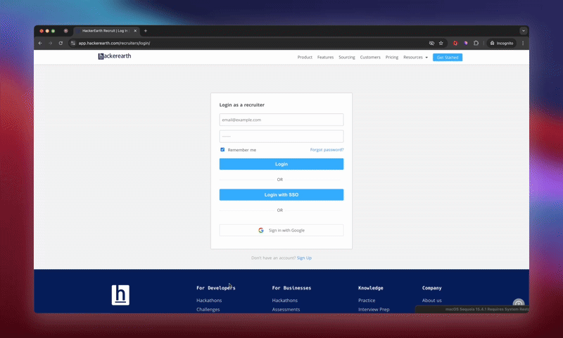

# Time to Hack 🔐

Most websites suck at telling you if your password is actually secure. They are still stuck in the 2000s, using outdated password rules. They check for symbols, numbers, uppercase letters—then rate `Password1!` as “strong”. But any real attacker cracks that in minutes.

I got tired of these outdated rules that don’t reflect actual security. So I built **Time To Hack**. This Chrome extension estimates how long it would actually take to crack your password (as you type), across realistic attack scenarios using entropy analysis, pattern recognition, and modern cracking models.

## Demo

## Why Traditional Rules Fail?

Composition-based rules (e.g., one number, one symbol) often lead to predictable formats:

- Capitalized first letter
- Year appended at the end
- `!` or `123` as a suffix
- `p@ssw0rd` - style substitutions

Attackers know these tricks. Tools like `Hashcat` are trained on these patterns. So `Password1!` is still toast in minutes if stored insecurely.

## What This Extension Does

Whenever you type a password on any site:

- Estimates crack time under 3 real-world attack models
- Checks against common patterns from breached passwords & highlights weaknesses using dictionary, keyboard, and pattern analysis
- Finds substitutions and sequences like `qwerty`, `asdf`, `1111`, etc.
- Calculates effective entropy (in bits, not gut feeling) using `zxcvbn` logic
- Shows actual crack time in seconds, days, or centuries
- Gives real suggestions to strengthen it

## How It Works (Under the Hood)

- **Pattern Detection**: Identifies dictionary words, substitutions, sequences (asdf, qwerty, etc.)
- **Entropy Calculation**: Assigns bit-level randomness to patterns, computes guess count
- **Time Estimation**: `Crack Time = Guesses / Attack Speed`
- **Scoring**: Uses `zxcvbn` under the hood, with custom enhancements for better UI and clarity

The core logic comes from Dropbox's [zxcvbn](https://github.com/dropbox/zxcvbn) library. But it’s not just a rule-based checker. It’s trained on:

- Breached password datasets
- Human typing patterns
- Keyboard layout guesses
- Name + year combos, movie quotes, dictionary words
- Smart transformations (like `p@55w0rd`)

It calculates pattern-based entropy, not random guessing space. So it knows that `Dragon@123` is not strong, even if it “looks” complex.

## Attack Models Simulated

| Scenario            | Speed             | Context                    |
| ------------------- | ----------------- | -------------------------- |
| Online Rate-Limited | 100 attempts/hour | Login page with throttling |
| Offline (Slow Hash) | 10K guesses/sec   | Breach + bcrypt/PBKDF2     |
| Offline (Fast Hash) | 10B guesses/sec   | Breach + MD5/SHA1          |

## Examples

| Password                   | Traditional Verdict | Real Crack Time (Offline Fast) |
| -------------------------- | ------------------- | ------------------------------ |
| `Password1!`               | Strong              | 3 hours                        |
| `p@ssw0rd`                 | Strong              | 19 minutes                     |
| `blueberry pancakes`       | Weak                | 89 years                       |
| `correct horse battery...` | Weak                | Centuries                      |

## Built with ❤️ by

[Pankaj Tanwar](https://twitter.com/the2ndfloorguy), and checkout his [other side-hustles](https://pankajtanwar.in/side-hustles)

## Contributing

I welcome contributions to the `time-to-hack` project! Whether it's a bug fix, a feature request, or improving documentation, your contributions are appreciated.